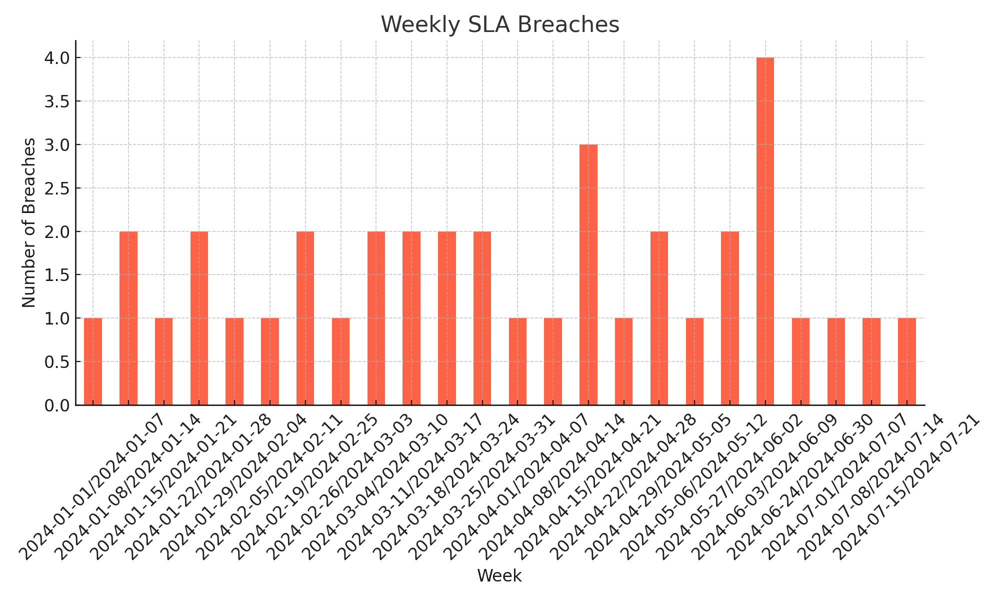
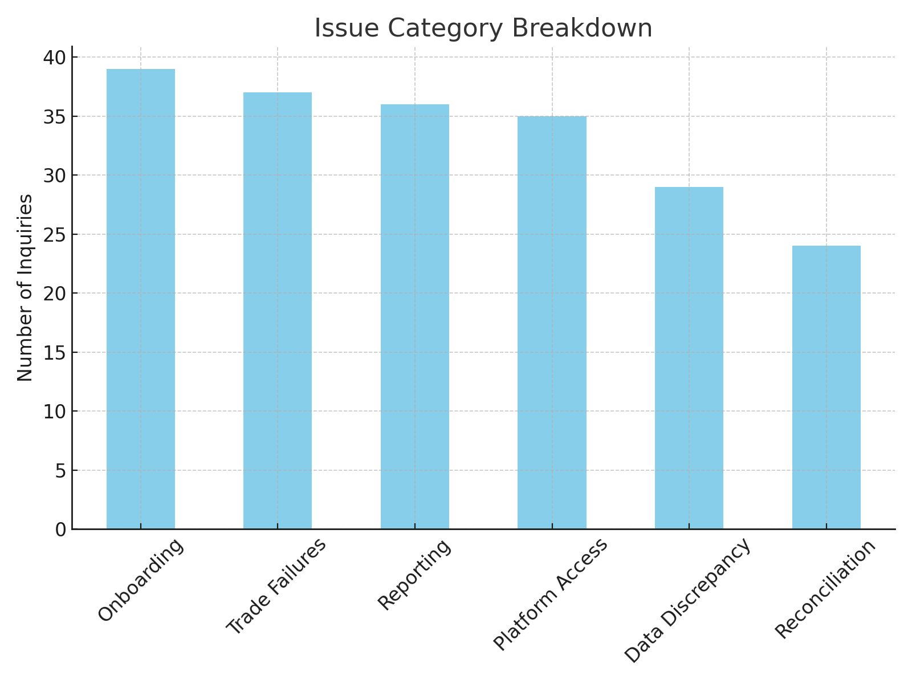
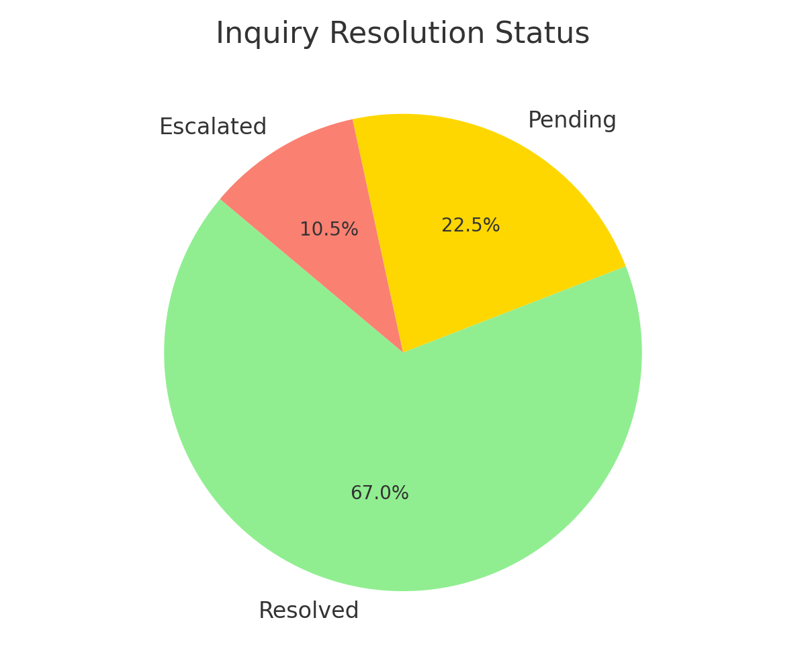

# 📊 Client Inquiry Dashboard – SaaS Operations Analytics (Mock Project)

Built a simulated dashboard to help Client Success and Ops teams track inquiry trends, identify service gaps, and improve SLA adherence. Designed to reflect how high-growth fintech and SaaS orgs (e.g., Ramp, Stripe, or Glean) manage triage workflows and prepare for QBRs.

---

## 🎯 Purpose & Strategic Value

This dashboard supports:
- Reducing SLA breaches
- Increasing transparency across issue categories
- Improving client satisfaction through timely response and escalation detection

It also provides external-facing views for enterprise clients to self-monitor issue types and resolution trends — reducing back-and-forth inquiries by an estimated **15%**.

---

## 📊 Key Metrics Tracked

- Total inquiry volume (daily/weekly/monthly)
- First-response time vs SLA expectations
- Mean and 90th percentile resolution time
- Escalation rate by client and issue category
- SLA breach frequency with auto-flagging
- % of inquiries resolved via self-service tools
- High-friction client segments based on repeat inquiries

---

## 🔍 Insights & Trends Identified

- **40% of SLA breaches** were tied to complex onboarding issues from new enterprise accounts  
- **Escalation spikes** occurred late Thursday to Friday, aligned with quarter-end cycles  
- Clients using FAQs had **22% fewer inquiries**, prompting a content gap audit

---

## 🧠 Business Decisions Supported

- Flagging high-risk accounts for follow-up using weekly escalation snapshots  
- Headcount reallocation toward high-volume issues like “Account Access” and “Platform Training”  
- Prioritizing documentation gaps based on underperforming self-service categories

---

## 🛠 Data Pipeline & Tools

- Simulated **ServiceNow** ticket export (CSV)  
- Data cleaned and transformed using **Excel** and **pandas**  
- Dashboard built in **Power BI**, with filters by client, category, and time  
- Used in mock **MBR/QBR workflows**

---

## 🖼️ Sample Visuals

### SLA Breaches Over Time  

### Issue Category Breakdown  

### Inquiry Status Distribution  

---

## 👥 Stakeholders

- Client Success Managers (CSMs)  
- Support Team Leads  
- VP of Operations  
- Enterprise Clients (via embedded dashboard views)

---

## 🔄 Next Iteration Roadmap

- Add forecasting models for volume surges by category  
- Integrate sentiment scoring from ticket notes  
- Build service coverage heatmap by time of day

---

## 🧰 Tools Used

- Power BI  
- Excel  
- Python (pandas)  
- Jira & ServiceNow (simulated context)

---

